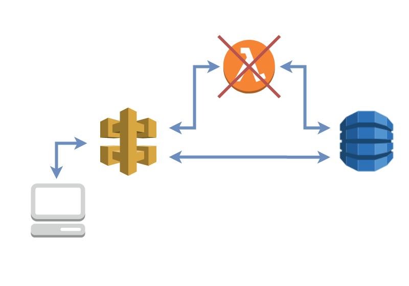

# Cut Out the Middleman Accessing DynamoDB

Although accessing storage, utilising Lambda, is relatively inexpensive on AWS.  Removing the intermediate Lambda will make the application cheaper to run and operate even faster

This project contains source code and supporting files for the following post.  
https://iwankruger.com/posts/dynamodb_sam

